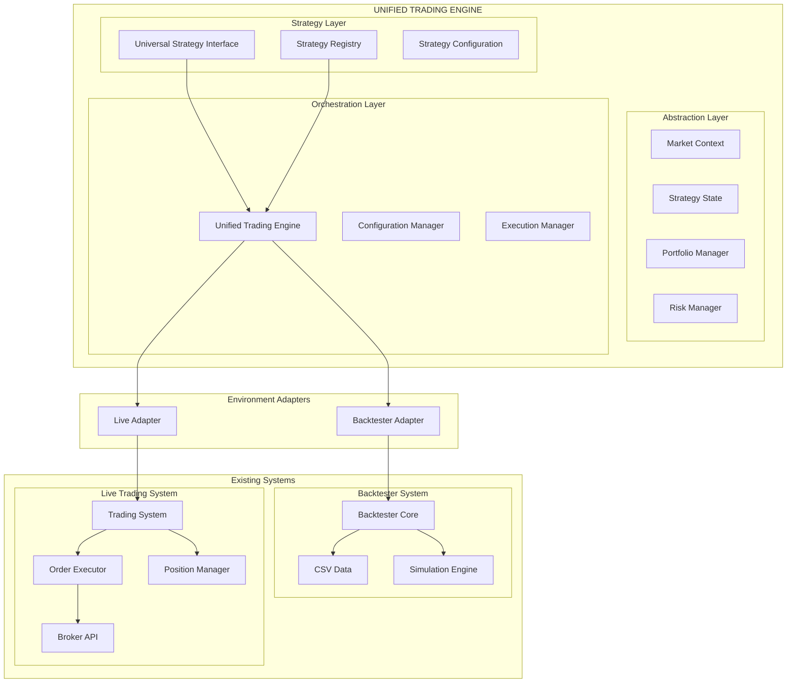
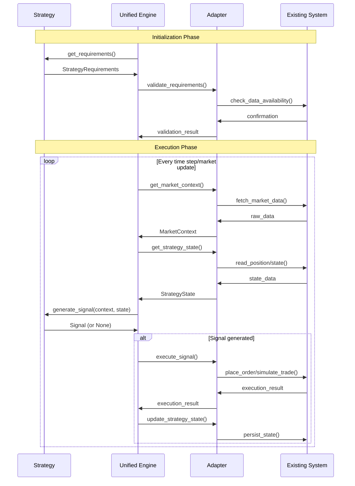
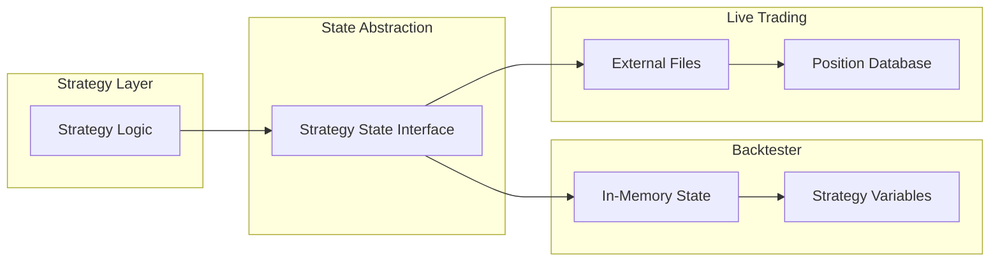

# 🏗️ Unified Trading System Architecture

## 🎯 Architecture Overview

The Unified Trading System implements a **thick orchestration layer** that sits above existing backtesting and live trading systems, providing a common interface for strategy development while leveraging proven infrastructure.

### **Core Design Principles**

1. **Strategy Virtual Machine**: Strategies run in an abstract environment, unaware of execution context
2. **Adapter Pattern**: Bridge existing systems without breaking them
3. **Single Source of Truth**: One strategy implementation for both environments
4. **Abstraction Layers**: Hide complexity while preserving functionality
5. **Backward Compatibility**: Existing systems continue working during migration

## 🔧 System Components Architecture



## 📊 Component Breakdown

### **1. Universal Strategy Interface**

The core abstraction that all strategies implement:

```python
from abc import ABC, abstractmethod
from typing import Dict, Any, Optional, List
from dataclasses import dataclass

@dataclass
class StrategyRequirements:
    """Data and computational requirements for strategy"""
    timeframes: List[str]  # ['5m', '15m']
    warmup_periods: Dict[str, int]  # {'5m': 175, '15m': 525}
    minimum_candles: Dict[str, int]  # {'5m': 40, '15m': 40}

@dataclass
class Signal:
    """Universal signal format"""
    action: str  # 'BUY', 'SELL'
    symbol: str
    price: float
    confidence: float  # 0.0 - 1.0
    reason: str
    is_exit: bool = False
    metadata: Dict[str, Any] = None

class UniversalStrategy(ABC):
    """Base class for all unified strategies"""

    @abstractmethod
    def get_requirements(self) -> StrategyRequirements:
        """Declare data and computational requirements"""
        pass

    @abstractmethod
    def generate_signal(self,
                       context: 'MarketContext',
                       state: 'StrategyState') -> Optional[Signal]:
        """Generate trading signal - identical logic for both environments"""
        pass

    @abstractmethod
    def initialize_state(self) -> Dict[str, Any]:
        """Initialize strategy-specific state variables"""
        pass

    def validate_signal(self, signal: Signal) -> bool:
        """Validate generated signal (optional override)"""
        return True

    def on_execution_result(self, signal: Signal, result: Dict[str, Any]) -> None:
        """React to execution result (optional override)"""
        pass
```

### **2. Market Context Abstraction**

Provides unified access to market data regardless of source:

```python
from typing import Union
import pandas as pd

class MarketContext:
    """Unified market data interface"""

    def __init__(self, data_provider: 'DataProvider', symbol: str):
        self.data_provider = data_provider
        self.symbol = symbol
        self.current_time = None

    def get_timeframe_data(self, timeframe: str, periods: int = None) -> pd.DataFrame:
        """Get OHLCV data for specific timeframe"""
        return self.data_provider.get_data(self.symbol, timeframe, periods)

    def get_current_price(self) -> float:
        """Get current/latest price"""
        return self.data_provider.get_current_price(self.symbol)

    def get_current_time(self) -> datetime:
        """Get current timestamp in strategy execution"""
        return self.current_time

    def is_market_open(self) -> bool:
        """Check if market is currently open"""
        return self.data_provider.is_market_open()

class DataProvider(ABC):
    """Abstract data provider - different implementations for backtest vs live"""

    @abstractmethod
    def get_data(self, symbol: str, timeframe: str, periods: int = None) -> pd.DataFrame:
        pass

    @abstractmethod
    def get_current_price(self, symbol: str) -> float:
        pass

    @abstractmethod
    def is_market_open(self) -> bool:
        pass
```

### **3. Strategy State Abstraction**

Manages strategy state with different storage backends:

```python
class StrategyState(ABC):
    """Abstract strategy state management"""

    @abstractmethod
    def get(self, key: str, default: Any = None) -> Any:
        """Get strategy variable"""
        pass

    @abstractmethod
    def set(self, key: str, value: Any) -> None:
        """Set strategy variable"""
        pass

    @abstractmethod
    def get_position_info(self) -> 'PositionInfo':
        """Get current position information"""
        pass

    @abstractmethod
    def clear(self) -> None:
        """Clear all state (position closed)"""
        pass

@dataclass
class PositionInfo:
    """Unified position information"""
    symbol: str
    has_position: bool = False
    side: str = "FLAT"  # 'LONG', 'SHORT', 'FLAT'
    quantity: int = 0
    entry_price: float = 0.0
    entry_time: datetime = None
    unrealized_pnl: float = 0.0

class BacktestStrategyState(StrategyState):
    """Strategy state stored in memory (backtester)"""

    def __init__(self):
        self.variables = {}
        self.position = PositionInfo()

    def get(self, key: str, default: Any = None) -> Any:
        return self.variables.get(key, default)

    def set(self, key: str, value: Any) -> None:
        self.variables[key] = value

    def get_position_info(self) -> PositionInfo:
        return self.position

class LiveStrategyState(StrategyState):
    """Strategy state stored externally (live trading)"""

    def __init__(self, position_manager: 'UnifiedPositionManager', strategy_name: str):
        self.position_manager = position_manager
        self.strategy_name = strategy_name

    def get(self, key: str, default: Any = None) -> Any:
        return self.position_manager.get_strategy_variable(self.strategy_name, key, default)

    def set(self, key: str, value: Any) -> None:
        self.position_manager.set_strategy_variable(self.strategy_name, key, value)

    def get_position_info(self) -> PositionInfo:
        return self.position_manager.get_position_info(self.strategy_name)
```

### **4. Unified Trading Engine**

The orchestration layer that coordinates everything:

```python
class UnifiedTradingEngine:
    """Main orchestration engine"""

    def __init__(self, config_path: str):
        self.config = self._load_configuration(config_path)
        self.strategy_registry = StrategyRegistry()

        # Initialize environment-specific components
        self.execution_mode = self.config.execution.mode  # 'backtest' or 'live'

        if self.execution_mode == 'backtest':
            self.adapter = BacktesterAdapter(self.config)
        elif self.execution_mode == 'live':
            self.adapter = LiveTradingAdapter(self.config)
        else:
            raise ValueError(f"Unknown execution mode: {self.execution_mode}")

        # Initialize unified components
        self.portfolio_manager = UnifiedPortfolioManager(self.config)
        self.risk_manager = UnifiedRiskManager(self.config)

    def run(self) -> 'ExecutionResults':
        """Main execution method - same interface for both modes"""

        # Load and validate strategies
        strategies = self._load_strategies()

        # Initialize portfolio
        self.portfolio_manager.initialize()

        # Run execution loop (different implementations)
        results = self.adapter.execute_strategies(strategies)

        # Generate unified results
        return self._generate_results(results)

    def _load_strategies(self) -> List[UniversalStrategy]:
        """Load strategies from configuration"""
        strategies = []

        for strategy_config in self.config.strategies:
            strategy_class = self.strategy_registry.get(strategy_config.name)
            strategy = strategy_class()

            # Validate strategy requirements
            self._validate_strategy_requirements(strategy, strategy_config)

            strategies.append(strategy)

        return strategies

    def _validate_strategy_requirements(self, strategy: UniversalStrategy, config: Dict):
        """Ensure strategy requirements can be met"""
        requirements = strategy.get_requirements()

        # Validate timeframe availability
        available_timeframes = self.adapter.get_available_timeframes()
        missing = set(requirements.timeframes) - set(available_timeframes)
        if missing:
            raise ValueError(f"Missing required timeframes: {missing}")

        # Validate warmup periods
        for tf, periods in requirements.warmup_periods.items():
            if not self.adapter.can_provide_warmup(tf, periods):
                raise ValueError(f"Cannot provide {periods} periods for {tf} timeframe")
```

### **5. Environment Adapters**

Bridge the unified engine to existing systems:

```python
class BacktesterAdapter:
    """Adapter for existing backtesting system"""

    def __init__(self, config: TradingConfig):
        # Import and initialize existing backtester components
        from src.runners.unified_runner import UnifiedRunner
        from src.strat_stats.strategy_executor import StrategyExecutor

        self.config = config
        self.unified_runner = UnifiedRunner()
        self.strategy_executor = StrategyExecutor()

    def execute_strategies(self, strategies: List[UniversalStrategy]) -> Dict[str, Any]:
        """Execute strategies using existing backtester infrastructure"""

        all_results = {}

        for strategy in strategies:
            # Create environment context
            data_provider = HistoricalDataProvider(self.config.data_source)

            # Execute strategy for each symbol
            strategy_results = {}

            for symbol in self.config.symbols:
                # Create market context
                market_context = MarketContext(data_provider, symbol)

                # Create strategy state (in-memory for backtest)
                strategy_state = BacktestStrategyState()

                # Run backtesting simulation
                symbol_results = self._run_backtest_simulation(
                    strategy, market_context, strategy_state, symbol
                )

                strategy_results[symbol] = symbol_results

            all_results[strategy.__class__.__name__] = strategy_results

        return all_results

    def _run_backtest_simulation(self,
                                strategy: UniversalStrategy,
                                context: MarketContext,
                                state: StrategyState,
                                symbol: str) -> Dict[str, Any]:
        """Run simulation using two-bar execution rule"""

        # Get historical data
        requirements = strategy.get_requirements()
        timeline = self._build_timeline(symbol, requirements)

        trades = []
        pending_signals = []

        for timestamp in timeline:
            # Update market context
            context.current_time = timestamp

            # Execute pending signals from previous bar
            for pending_signal in pending_signals:
                execution_result = self._simulate_execution(pending_signal, context)
                trades.append(execution_result)

                # Update strategy state
                self._update_position_state(state, execution_result)

            # Clear executed signals
            pending_signals.clear()

            # Generate new signal for next bar execution
            signal = strategy.generate_signal(context, state)

            if signal and self._validate_signal(signal):
                pending_signals.append(signal)

        return {
            'trades': trades,
            'final_state': state.variables,
            'performance_metrics': self._calculate_metrics(trades)
        }

class LiveTradingAdapter:
    """Adapter for existing live trading system"""

    def __init__(self, config: TradingConfig):
        # Import and initialize existing live trading components
        from live_module.src.central_ops.trading_system import TradingSystem
        from live_module.src.central_ops.unified_order_executor import UnifiedOrderExecutor
        from live_module.src.position.unified_position_manager import UnifiedPositionManager

        self.config = config
        self.trading_system = TradingSystem()
        self.order_executor = UnifiedOrderExecutor()
        self.position_manager = UnifiedPositionManager()

    def execute_strategies(self, strategies: List[UniversalStrategy]) -> Dict[str, Any]:
        """Execute strategies using existing live trading infrastructure"""

        # Create real-time data provider
        data_provider = LiveDataProvider(self.config.broker)

        # Start data streams
        data_provider.start_streams(self.config.symbols)

        try:
            # Run continuous execution loop
            while self._should_continue_trading():

                for strategy in strategies:
                    for symbol in self.config.symbols:

                        # Create market context
                        market_context = MarketContext(data_provider, symbol)

                        # Create strategy state (external storage for live)
                        strategy_state = LiveStrategyState(
                            self.position_manager,
                            f"{strategy.__class__.__name__}_{symbol}"
                        )

                        # Generate signal
                        signal = strategy.generate_signal(market_context, strategy_state)

                        if signal and self._validate_signal(signal):
                            # Execute immediately (no two-bar delay in live)
                            execution_result = self._execute_live_signal(signal)

                            # Notify strategy of execution result
                            strategy.on_execution_result(signal, execution_result)

                # Wait for next iteration
                time.sleep(self.config.execution_interval)

        finally:
            data_provider.stop_streams()

        return self._get_live_results()

    def _execute_live_signal(self, signal: Signal) -> Dict[str, Any]:
        """Execute signal using existing live trading infrastructure"""

        # Convert unified signal to system-specific format
        order_request = self._convert_signal_to_order(signal)

        # Use existing order execution pipeline
        execution_result = self.order_executor.execute_order(order_request)

        # Update position tracking
        self.position_manager.update_position(execution_result)

        return execution_result
```

## 🔄 Data Flow Architecture

### **Unified Data Pipeline**



### **State Management Flow**



## 🎛️ Configuration Architecture

### **Unified Configuration Schema**

```yaml
# unified_config.yaml
trading_engine:
  # Execution mode
  mode: "backtest"  # or "live"

  # Portfolio configuration
  portfolio:
    initial_capital: 1000000
    allocation_method: "percentage"

  # Strategy configuration
  strategies:
    - name: "MSE"
      class: "UnifiedMSEStrategy"
      symbols: ["RELIANCE", "TCS", "INFY"]
      allocation_per_symbol: 0.15
      parameters:
        exit_threshold: 0.80

  # Risk management
  risk_management:
    max_position_size: 50000
    max_portfolio_risk: 0.02
    stop_loss_percent: 0.02

  # Environment-specific settings
  backtesting:
    date_range:
      start: "2024-01-01"
      end: "2024-12-31"
    data_source:
      type: "csv"
      path: "./data/pools/"
    execution:
      slippage: 0.001
      commission: 0.0001

  live_trading:
    broker: "upstox"
    data_source:
      type: "websocket"
      url: "wss://api.upstox.com"
    execution:
      order_type: "market"
      timeout: 30
```

## 🔒 Security & Risk Management

### **Unified Risk Framework**

```python
class UnifiedRiskManager:
    """Risk management across both environments"""

    def __init__(self, config: RiskConfig):
        self.config = config
        self.position_limits = config.position_limits
        self.portfolio_limits = config.portfolio_limits

    def validate_signal(self, signal: Signal, current_state: StrategyState) -> RiskValidationResult:
        """Validate signal against risk rules"""

        checks = [
            self._check_position_size_limit(signal),
            self._check_portfolio_exposure_limit(signal, current_state),
            self._check_daily_loss_limit(current_state),
            self._check_symbol_circuit_breaker(signal.symbol),
            self._check_market_hours(signal),
        ]

        return RiskValidationResult(
            approved=all(check.approved for check in checks),
            rejections=[check for check in checks if not check.approved],
            adjustments=self._calculate_adjustments(signal, checks)
        )

    def monitor_positions(self, positions: List[PositionInfo]) -> List[RiskAlert]:
        """Monitor existing positions for risk violations"""

        alerts = []

        for position in positions:
            # Check unrealized loss limits
            if position.unrealized_pnl < -self.config.max_position_loss:
                alerts.append(RiskAlert(
                    severity="HIGH",
                    message=f"Position {position.symbol} exceeds max loss limit",
                    recommended_action="CLOSE_POSITION"
                ))

            # Check position concentration
            portfolio_value = self._calculate_portfolio_value(positions)
            position_weight = abs(position.unrealized_pnl) / portfolio_value

            if position_weight > self.config.max_position_weight:
                alerts.append(RiskAlert(
                    severity="MEDIUM",
                    message=f"Position {position.symbol} weight {position_weight:.2%} exceeds limit",
                    recommended_action="REDUCE_POSITION"
                ))

        return alerts
```

---

## 🚀 Next Steps

1. **Review**: Study this architecture design thoroughly
2. **Validate**: Ensure all requirements are addressed
3. **Plan**: Move to [Implementation Plan](../implementation/IMPLEMENTATION_PLAN.md)
4. **Design**: Review [System Flow Diagrams](../diagrams/SYSTEM_FLOWS.md)

This architecture provides the foundation for creating a truly unified algorithmic trading system that maintains the benefits of existing infrastructure while enabling strategy portability across environments.