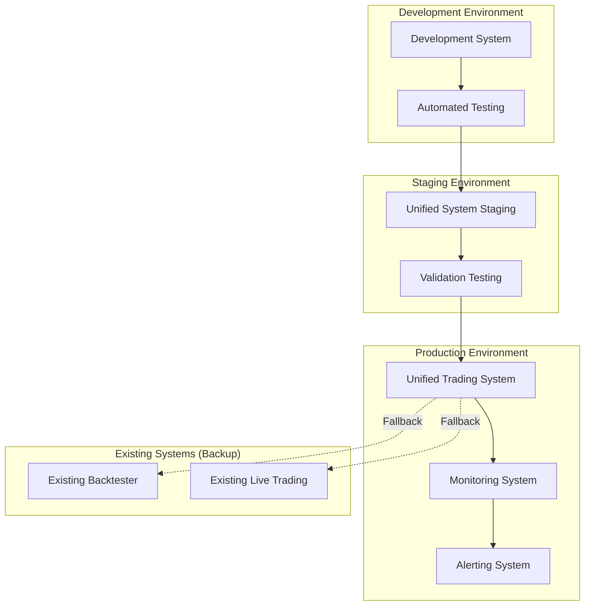

# 🚀 Unified Trading System Deployment Guide

## 🎯 Deployment Overview

This guide covers the complete deployment process for the unified trading system, from development environment through production deployment. The deployment follows a staged approach with comprehensive validation at each step.

### **Deployment Principles**

1. **Zero Downtime**: Existing systems continue operating during unified system deployment
2. **Gradual Migration**: Strategies migrated one at a time with validation
3. **Rollback Ready**: Instant rollback to existing systems if needed
4. **Comprehensive Monitoring**: Full observability during transition
5. **Risk Mitigation**: Multiple validation checkpoints before production

## 📋 Pre-Deployment Checklist

### **Code Quality Validation**

- [ ] All unit tests passing (>90% coverage)
- [ ] Integration tests passing
- [ ] Performance benchmarks within thresholds
- [ ] Code review completed and approved
- [ ] Documentation complete and up-to-date

### **System Validation**

- [ ] Signal parity validation >99.5%
- [ ] Performance validation within tolerances
- [ ] Security assessment completed
- [ ] Backup and recovery procedures tested
- [ ] Monitoring and alerting operational

### **Environment Preparation**

- [ ] Production environment configured
- [ ] Secrets and credentials secured
- [ ] Database/storage systems ready
- [ ] Network connectivity verified
- [ ] Monitoring dashboards configured

## 🏗️ Deployment Architecture

### **Environment Overview**



## 📦 Deployment Packages

### **Package Structure**

```
unified_trading_deployment/
├── releases/                      # Release packages
│   └── v1.0.0/
│       ├── unified_trading/       # Main application
│       ├── config/               # Configuration files
│       ├── scripts/              # Deployment scripts
│       └── docs/                 # Release documentation
├── environments/                 # Environment-specific configs
│   ├── staging/
│   ├── production/
│   └── backup/
├── monitoring/                   # Monitoring configuration
│   ├── dashboards/
│   ├── alerts/
│   └── logs/
└── deployment/                   # Deployment automation
    ├── docker/
    ├── scripts/
    └── tests/
```

### **Release Package Creation**

```bash
#!/bin/bash
# scripts/create_release_package.sh

set -e

VERSION=$1
if [ -z "$VERSION" ]; then
    echo "Usage: $0 <version>"
    exit 1
fi

echo "Creating release package for version $VERSION"

# Create release directory
RELEASE_DIR="releases/v$VERSION"
mkdir -p "$RELEASE_DIR"

# Package main application
echo "Packaging unified trading system..."
cp -r unified_trading/ "$RELEASE_DIR/"
cp -r config/ "$RELEASE_DIR/"
cp requirements.txt "$RELEASE_DIR/"
cp main.py "$RELEASE_DIR/"

# Remove development files
find "$RELEASE_DIR" -name "*.pyc" -delete
find "$RELEASE_DIR" -name "__pycache__" -exec rm -rf {} + 2>/dev/null || true
find "$RELEASE_DIR" -name "*.git*" -exec rm -rf {} + 2>/dev/null || true

# Package deployment scripts
echo "Packaging deployment scripts..."
cp -r deployment/scripts/ "$RELEASE_DIR/scripts/"
chmod +x "$RELEASE_DIR/scripts/"*.sh

# Package configuration
echo "Packaging configuration files..."
cp -r environments/ "$RELEASE_DIR/"

# Package monitoring
echo "Packaging monitoring configuration..."
cp -r monitoring/ "$RELEASE_DIR/"

# Create version info
echo "Creating version information..."
cat > "$RELEASE_DIR/VERSION" << EOF
Version: $VERSION
Build Date: $(date -u +"%Y-%m-%d %H:%M:%S UTC")
Git Commit: $(git rev-parse HEAD)
Git Branch: $(git rev-parse --abbrev-ref HEAD)
EOF

# Create checksums
echo "Creating checksums..."
find "$RELEASE_DIR" -type f -exec sha256sum {} \; > "$RELEASE_DIR/CHECKSUMS"

# Create tarball
echo "Creating release tarball..."
tar -czf "unified_trading_v$VERSION.tar.gz" -C releases "v$VERSION"

echo "Release package created: unified_trading_v$VERSION.tar.gz"
```

## 🎯 Staged Deployment Process

### **Stage 1: Development Validation**

#### **Automated Testing Pipeline**

```yaml
# .github/workflows/deployment_validation.yml
name: Deployment Validation

on:
  push:
    branches: [main, release/*]
  pull_request:
    branches: [main]

jobs:
  unit_tests:
    runs-on: ubuntu-latest
    steps:
      - uses: actions/checkout@v3
        with:
          submodules: recursive

      - name: Set up Python
        uses: actions/setup-python@v3
        with:
          python-version: '3.9'

      - name: Install dependencies
        run: |
          pip install -r requirements.txt
          pip install -r requirements-dev.txt

      - name: Run unit tests
        run: |
          pytest tests/unit/ --cov=core --cov=strategies --cov-report=xml

      - name: Upload coverage
        uses: codecov/codecov-action@v3
        with:
          file: ./coverage.xml

  integration_tests:
    runs-on: ubuntu-latest
    needs: unit_tests
    steps:
      - uses: actions/checkout@v3
        with:
          submodules: recursive

      - name: Set up Python
        uses: actions/setup-python@v3
        with:
          python-version: '3.9'

      - name: Run integration tests
        run: |
          pytest tests/integration/ -v

  performance_tests:
    runs-on: ubuntu-latest
    needs: integration_tests
    steps:
      - uses: actions/checkout@v3
        with:
          submodules: recursive

      - name: Set up Python
        uses: actions/setup-python@v3
        with:
          python-version: '3.9'

      - name: Run performance benchmarks
        run: |
          pytest tests/performance/ --benchmark-only --benchmark-json=benchmark.json

      - name: Validate performance thresholds
        run: |
          python scripts/validate_performance.py benchmark.json

  validation_tests:
    runs-on: ubuntu-latest
    needs: performance_tests
    steps:
      - uses: actions/checkout@v3
        with:
          submodules: recursive

      - name: Run signal parity validation
        run: |
          python scripts/run_validation_tests.py --output validation_report.json

      - name: Check validation results
        run: |
          python scripts/check_validation_results.py validation_report.json
```

### **Stage 2: Staging Deployment**

#### **Staging Environment Setup**

```bash
#!/bin/bash
# deployment/scripts/setup_staging.sh

set -e

echo "Setting up staging environment..."

# Create staging directories
sudo mkdir -p /opt/unified_trading/staging
sudo mkdir -p /var/log/unified_trading/staging
sudo mkdir -p /etc/unified_trading/staging

# Extract release package
tar -xzf unified_trading_v$VERSION.tar.gz
sudo cp -r v$VERSION/* /opt/unified_trading/staging/

# Set permissions
sudo chown -R trading:trading /opt/unified_trading/staging
sudo chown -R trading:trading /var/log/unified_trading/staging
sudo chmod +x /opt/unified_trading/staging/scripts/*.sh

# Install Python dependencies
cd /opt/unified_trading/staging
sudo -u trading python -m venv venv
sudo -u trading ./venv/bin/pip install -r requirements.txt

# Copy staging configuration
sudo cp environments/staging/* /etc/unified_trading/staging/

# Set up systemd service
sudo cp deployment/systemd/unified-trading-staging.service /etc/systemd/system/
sudo systemctl daemon-reload

# Set up monitoring
sudo cp monitoring/staging/* /etc/monitoring/
sudo systemctl restart monitoring-agent

echo "Staging environment setup complete"
```

#### **Staging Validation Tests**

```python
# scripts/staging_validation.py
"""
Staging environment validation tests
"""

import sys
import time
import requests
import subprocess
from datetime import datetime, timedelta

class StagingValidator:
    """Comprehensive staging validation"""

    def __init__(self, config_path: str):
        self.config_path = config_path
        self.validation_results = {}

    def run_all_validations(self) -> bool:
        """Run all staging validation tests"""

        print("🧪 Starting staging validation tests...")

        validations = [
            ('system_health', self.validate_system_health),
            ('configuration', self.validate_configuration),
            ('data_connectivity', self.validate_data_connectivity),
            ('signal_generation', self.validate_signal_generation),
            ('performance', self.validate_performance),
            ('monitoring', self.validate_monitoring)
        ]

        all_passed = True

        for name, validation_func in validations:
            print(f"\n📋 Running {name} validation...")

            try:
                result = validation_func()
                self.validation_results[name] = result

                if result['passed']:
                    print(f"✅ {name} validation passed")
                else:
                    print(f"❌ {name} validation failed: {result.get('error', 'Unknown error')}")
                    all_passed = False

            except Exception as e:
                print(f"💥 {name} validation crashed: {e}")
                self.validation_results[name] = {'passed': False, 'error': str(e)}
                all_passed = False

        self.generate_validation_report()
        return all_passed

    def validate_system_health(self) -> dict:
        """Validate system health and resource usage"""

        try:
            # Check if unified trading service is running
            result = subprocess.run(['systemctl', 'is-active', 'unified-trading-staging'],
                                  capture_output=True, text=True)

            if result.returncode != 0:
                return {'passed': False, 'error': 'Unified trading service not running'}

            # Check resource usage
            import psutil

            cpu_usage = psutil.cpu_percent(interval=5)
            memory_usage = psutil.virtual_memory().percent
            disk_usage = psutil.disk_usage('/').percent

            if cpu_usage > 80:
                return {'passed': False, 'error': f'High CPU usage: {cpu_usage}%'}

            if memory_usage > 80:
                return {'passed': False, 'error': f'High memory usage: {memory_usage}%'}

            if disk_usage > 90:
                return {'passed': False, 'error': f'High disk usage: {disk_usage}%'}

            return {
                'passed': True,
                'metrics': {
                    'cpu_usage': cpu_usage,
                    'memory_usage': memory_usage,
                    'disk_usage': disk_usage
                }
            }

        except Exception as e:
            return {'passed': False, 'error': str(e)}

    def validate_signal_generation(self) -> dict:
        """Validate signal generation with test data"""

        try:
            # Run signal generation test
            cmd = [
                '/opt/unified_trading/staging/venv/bin/python',
                '/opt/unified_trading/staging/main.py',
                '--config', '/etc/unified_trading/staging/test_config.yaml',
                '--mode', 'validate',
                '--duration', '300'  # 5 minutes
            ]

            result = subprocess.run(cmd, capture_output=True, text=True, timeout=600)

            if result.returncode != 0:
                return {'passed': False, 'error': f'Signal generation failed: {result.stderr}'}

            # Parse results
            # Implementation depends on output format
            output = result.stdout

            return {'passed': True, 'output': output}

        except subprocess.TimeoutExpired:
            return {'passed': False, 'error': 'Signal generation test timed out'}
        except Exception as e:
            return {'passed': False, 'error': str(e)}

    def validate_performance(self) -> dict:
        """Validate performance metrics"""

        try:
            # Run performance benchmark
            cmd = [
                '/opt/unified_trading/staging/venv/bin/python',
                '-m', 'pytest',
                '/opt/unified_trading/staging/tests/performance/',
                '--benchmark-only',
                '--benchmark-json=staging_benchmark.json'
            ]

            subprocess.run(cmd, cwd='/opt/unified_trading/staging', timeout=600)

            # Read benchmark results
            with open('/opt/unified_trading/staging/staging_benchmark.json', 'r') as f:
                import json
                benchmark_data = json.load(f)

            # Validate against thresholds
            for benchmark in benchmark_data.get('benchmarks', []):
                if benchmark['stats']['mean'] > benchmark.get('threshold', 0.1):
                    return {
                        'passed': False,
                        'error': f"Performance threshold exceeded: {benchmark['name']}"
                    }

            return {'passed': True, 'benchmarks': benchmark_data}

        except Exception as e:
            return {'passed': False, 'error': str(e)}

    def generate_validation_report(self):
        """Generate comprehensive validation report"""

        timestamp = datetime.now().strftime('%Y-%m-%d_%H-%M-%S')
        report_path = f'/var/log/unified_trading/staging/validation_report_{timestamp}.json'

        report = {
            'timestamp': datetime.now().isoformat(),
            'environment': 'staging',
            'validation_results': self.validation_results,
            'overall_status': all(r.get('passed', False) for r in self.validation_results.values())
        }

        with open(report_path, 'w') as f:
            import json
            json.dump(report, f, indent=2)

        print(f"\n📊 Validation report saved: {report_path}")

if __name__ == "__main__":
    validator = StagingValidator('/etc/unified_trading/staging/config.yaml')
    success = validator.run_all_validations()

    if success:
        print("\n🎉 All staging validations passed!")
        sys.exit(0)
    else:
        print("\n💥 Staging validation failed!")
        sys.exit(1)
```

### **Stage 3: Production Shadow Testing**

#### **Shadow Testing Setup**

```python
# scripts/shadow_testing.py
"""
Production shadow testing - run unified system alongside existing systems
"""

import asyncio
import logging
import json
from datetime import datetime, timedelta
from typing import Dict, Any, List

class ShadowTesting:
    """Run unified system in shadow mode alongside existing systems"""

    def __init__(self, config_path: str):
        self.config_path = config_path
        self.logger = logging.getLogger(__name__)
        self.results = {
            'unified_signals': [],
            'existing_signals': [],
            'comparisons': [],
            'performance_metrics': {}
        }

    async def run_shadow_testing(self, duration_hours: int = 24):
        """Run shadow testing for specified duration"""

        self.logger.info(f"Starting shadow testing for {duration_hours} hours")

        start_time = datetime.now()
        end_time = start_time + timedelta(hours=duration_hours)

        # Start unified system in shadow mode
        unified_task = asyncio.create_task(self.run_unified_shadow())

        # Start existing system monitoring
        existing_task = asyncio.create_task(self.monitor_existing_system())

        # Start comparison engine
        comparison_task = asyncio.create_task(self.run_signal_comparison())

        try:
            # Run until duration expires
            while datetime.now() < end_time:
                await asyncio.sleep(60)  # Check every minute

                # Health check
                if not self.check_system_health():
                    self.logger.error("System health check failed - stopping shadow testing")
                    break

            # Stop all tasks
            unified_task.cancel()
            existing_task.cancel()
            comparison_task.cancel()

            # Generate final report
            self.generate_shadow_report()

        except Exception as e:
            self.logger.error(f"Shadow testing failed: {e}")
            raise

    async def run_unified_shadow(self):
        """Run unified system in shadow mode (no real orders)"""

        while True:
            try:
                # Get market data
                market_data = await self.get_current_market_data()

                # Generate signals using unified system
                unified_signals = await self.generate_unified_signals(market_data)

                # Store signals for comparison
                for signal in unified_signals:
                    signal['timestamp'] = datetime.now()
                    signal['source'] = 'unified'
                    self.results['unified_signals'].append(signal)

                await asyncio.sleep(5)  # 5-second intervals

            except Exception as e:
                self.logger.error(f"Unified shadow execution error: {e}")
                await asyncio.sleep(10)

    async def monitor_existing_system(self):
        """Monitor existing system signals"""

        while True:
            try:
                # Read signals from existing system logs/files
                existing_signals = await self.read_existing_system_signals()

                # Store signals for comparison
                for signal in existing_signals:
                    signal['timestamp'] = datetime.now()
                    signal['source'] = 'existing'
                    self.results['existing_signals'].append(signal)

                await asyncio.sleep(5)

            except Exception as e:
                self.logger.error(f"Existing system monitoring error: {e}")
                await asyncio.sleep(10)

    async def run_signal_comparison(self):
        """Continuously compare signals from both systems"""

        while True:
            try:
                # Compare recent signals (last 5 minutes)
                recent_cutoff = datetime.now() - timedelta(minutes=5)

                unified_recent = [
                    s for s in self.results['unified_signals']
                    if s['timestamp'] >= recent_cutoff
                ]

                existing_recent = [
                    s for s in self.results['existing_signals']
                    if s['timestamp'] >= recent_cutoff
                ]

                # Perform comparison
                comparison_results = self.compare_signal_batches(unified_recent, existing_recent)
                self.results['comparisons'].extend(comparison_results)

                # Log significant differences
                for comp in comparison_results:
                    if not comp.get('signals_match', True):
                        self.logger.warning(f"Signal mismatch detected: {comp}")

                await asyncio.sleep(30)  # Compare every 30 seconds

            except Exception as e:
                self.logger.error(f"Signal comparison error: {e}")
                await asyncio.sleep(60)

    def compare_signal_batches(self, unified: List[Dict], existing: List[Dict]) -> List[Dict]:
        """Compare batches of signals"""

        comparisons = []

        # Group signals by timestamp windows
        for u_signal in unified:
            # Find matching existing signal within time window
            matching_existing = None
            time_window = timedelta(seconds=30)

            for e_signal in existing:
                if (abs((u_signal['timestamp'] - e_signal['timestamp']).total_seconds()) <= 30 and
                    u_signal.get('symbol') == e_signal.get('symbol')):
                    matching_existing = e_signal
                    break

            comparison = {
                'timestamp': u_signal['timestamp'],
                'symbol': u_signal.get('symbol'),
                'unified_signal': u_signal,
                'existing_signal': matching_existing,
                'signals_match': self.signals_match(u_signal, matching_existing),
                'comparison_time': datetime.now()
            }

            comparisons.append(comparison)

        return comparisons

    def signals_match(self, unified_signal: Dict, existing_signal: Dict) -> bool:
        """Check if signals match within tolerance"""

        if existing_signal is None:
            return unified_signal.get('action') is None

        # Compare action
        if unified_signal.get('action') != existing_signal.get('action'):
            return False

        # Compare price (within 0.1% tolerance)
        u_price = unified_signal.get('price', 0)
        e_price = existing_signal.get('price', 0)

        if e_price > 0:
            price_diff = abs((u_price - e_price) / e_price)
            if price_diff > 0.001:  # 0.1% tolerance
                return False

        return True

    def generate_shadow_report(self):
        """Generate comprehensive shadow testing report"""

        # Calculate statistics
        total_unified = len(self.results['unified_signals'])
        total_existing = len(self.results['existing_signals'])
        total_comparisons = len(self.results['comparisons'])

        matching_signals = sum(1 for c in self.results['comparisons'] if c.get('signals_match', False))
        signal_parity = (matching_signals / total_comparisons * 100) if total_comparisons > 0 else 0

        # Generate report
        report = {
            'shadow_testing_summary': {
                'start_time': self.results.get('start_time'),
                'end_time': datetime.now().isoformat(),
                'duration_hours': (datetime.now() - self.results.get('start_time', datetime.now())).total_seconds() / 3600,
                'total_unified_signals': total_unified,
                'total_existing_signals': total_existing,
                'total_comparisons': total_comparisons,
                'signal_parity_percentage': signal_parity,
                'validation_status': 'PASSED' if signal_parity >= 99.0 else 'FAILED'
            },
            'detailed_results': self.results,
            'recommendations': self.generate_recommendations(signal_parity)
        }

        # Save report
        timestamp = datetime.now().strftime('%Y-%m-%d_%H-%M-%S')
        report_path = f'/var/log/unified_trading/shadow_report_{timestamp}.json'

        with open(report_path, 'w') as f:
            json.dump(report, f, indent=2, default=str)

        self.logger.info(f"Shadow testing report saved: {report_path}")

        return report

    def generate_recommendations(self, signal_parity: float) -> List[str]:
        """Generate recommendations based on shadow testing results"""

        recommendations = []

        if signal_parity >= 99.5:
            recommendations.append("✅ Signal parity excellent - proceed with production deployment")
        elif signal_parity >= 99.0:
            recommendations.append("⚠️ Signal parity good - review differences before production")
        elif signal_parity >= 95.0:
            recommendations.append("🔍 Signal parity acceptable - investigate major differences")
        else:
            recommendations.append("❌ Signal parity poor - extensive debugging required")

        return recommendations
```

### **Stage 4: Production Deployment**

#### **Production Deployment Script**

```bash
#!/bin/bash
# deployment/scripts/deploy_production.sh

set -e

VERSION=$1
if [ -z "$VERSION" ]; then
    echo "Usage: $0 <version>"
    exit 1
fi

echo "🚀 Starting production deployment of unified trading system v$VERSION"

# Pre-deployment checks
echo "📋 Running pre-deployment checks..."
./scripts/pre_deployment_checks.sh || exit 1

# Create backup of existing systems
echo "💾 Creating backup of existing systems..."
./scripts/backup_existing_systems.sh

# Deploy unified system
echo "📦 Deploying unified trading system..."

# Extract release package
sudo mkdir -p /opt/unified_trading/production
tar -xzf releases/unified_trading_v$VERSION.tar.gz
sudo cp -r v$VERSION/* /opt/unified_trading/production/

# Set permissions
sudo chown -R trading:trading /opt/unified_trading/production
sudo chmod +x /opt/unified_trading/production/scripts/*.sh

# Install dependencies
cd /opt/unified_trading/production
sudo -u trading python -m venv venv
sudo -u trading ./venv/bin/pip install -r requirements.txt

# Deploy configuration
echo "⚙️ Deploying production configuration..."
sudo cp environments/production/* /etc/unified_trading/production/

# Update database/storage
echo "🗃️ Updating database schema..."
sudo -u trading ./scripts/update_database.sh

# Deploy monitoring
echo "📊 Deploying monitoring configuration..."
sudo cp monitoring/production/* /etc/monitoring/
sudo systemctl restart monitoring-agent

# Start services
echo "🏁 Starting unified trading services..."
sudo cp deployment/systemd/unified-trading-production.service /etc/systemd/system/
sudo systemctl daemon-reload
sudo systemctl enable unified-trading-production
sudo systemctl start unified-trading-production

# Health check
echo "🏥 Running post-deployment health check..."
sleep 30  # Wait for services to start
./scripts/health_check.sh production || {
    echo "❌ Health check failed - rolling back"
    ./scripts/rollback.sh
    exit 1
}

# Start monitoring
echo "👁️ Starting deployment monitoring..."
./scripts/start_deployment_monitoring.sh $VERSION

echo "✅ Production deployment completed successfully!"
echo "📊 Monitor deployment at: http://monitoring.yourdomain.com/unified-trading"
echo "🔄 Rollback available with: ./scripts/rollback.sh"
```

#### **Health Check Script**

```bash
#!/bin/bash
# scripts/health_check.sh

ENVIRONMENT=$1
if [ -z "$ENVIRONMENT" ]; then
    echo "Usage: $0 <environment>"
    exit 1
fi

echo "🏥 Running health check for $ENVIRONMENT environment..."

# Check service status
SERVICE_STATUS=$(systemctl is-active unified-trading-$ENVIRONMENT)
if [ "$SERVICE_STATUS" != "active" ]; then
    echo "❌ Service not active: $SERVICE_STATUS"
    exit 1
fi

# Check API endpoints
API_URL="http://localhost:8080"
if [ "$ENVIRONMENT" = "production" ]; then
    API_URL="http://production-api.yourdomain.com"
fi

# Health endpoint
HEALTH_RESPONSE=$(curl -s -o /dev/null -w "%{http_code}" $API_URL/health)
if [ "$HEALTH_RESPONSE" != "200" ]; then
    echo "❌ Health endpoint failed: HTTP $HEALTH_RESPONSE"
    exit 1
fi

# Strategy status endpoint
STRATEGY_RESPONSE=$(curl -s $API_URL/strategies/status)
if [ -z "$STRATEGY_RESPONSE" ]; then
    echo "❌ Strategy status endpoint failed"
    exit 1
fi

# Check log files
LOG_DIR="/var/log/unified_trading/$ENVIRONMENT"
if [ ! -f "$LOG_DIR/application.log" ]; then
    echo "❌ Application log file missing"
    exit 1
fi

# Check for critical errors in logs (last 5 minutes)
CRITICAL_ERRORS=$(find $LOG_DIR -name "*.log" -mmin -5 -exec grep -l "CRITICAL\|FATAL" {} \;)
if [ -n "$CRITICAL_ERRORS" ]; then
    echo "❌ Critical errors found in logs: $CRITICAL_ERRORS"
    exit 1
fi

# Check database connectivity
DB_CHECK=$(python3 -c "
import sys
sys.path.append('/opt/unified_trading/$ENVIRONMENT')
from core.database import check_connection
if check_connection():
    print('OK')
else:
    sys.exit(1)
")

if [ "$DB_CHECK" != "OK" ]; then
    echo "❌ Database connectivity check failed"
    exit 1
fi

# Check disk space
DISK_USAGE=$(df / | tail -1 | awk '{print $5}' | sed 's/%//')
if [ "$DISK_USAGE" -gt 90 ]; then
    echo "❌ Disk usage too high: ${DISK_USAGE}%"
    exit 1
fi

# Check memory usage
MEMORY_USAGE=$(free | grep Mem | awk '{printf "%.0f", $3/$2 * 100.0}')
if [ "$MEMORY_USAGE" -gt 90 ]; then
    echo "❌ Memory usage too high: ${MEMORY_USAGE}%"
    exit 1
fi

echo "✅ All health checks passed for $ENVIRONMENT environment"
```

## 📊 Monitoring and Alerting

### **Deployment Monitoring Dashboard**

```python
# monitoring/deployment_dashboard.py
import streamlit as st
import plotly.graph_objects as go
import plotly.express as px
import pandas as pd
import json
from datetime import datetime, timedelta

st.set_page_config(
    page_title="Unified Trading Deployment Monitor",
    page_icon="🚀",
    layout="wide"
)

class DeploymentMonitor:
    def __init__(self):
        self.deployment_start = self.get_deployment_start_time()

    def run_dashboard(self):
        st.title("🚀 Unified Trading System - Deployment Monitor")

        # Deployment status overview
        col1, col2, col3, col4 = st.columns(4)

        with col1:
            status = self.get_deployment_status()
            st.metric("Deployment Status", status['status'], status.get('delta'))

        with col2:
            uptime = self.get_system_uptime()
            st.metric("System Uptime", uptime['value'], uptime.get('delta'))

        with col3:
            signal_parity = self.get_signal_parity()
            st.metric("Signal Parity", f"{signal_parity['value']:.1f}%", signal_parity.get('delta'))

        with col4:
            performance = self.get_performance_status()
            st.metric("Performance", performance['status'], performance.get('delta'))

        # Signal comparison chart
        st.header("📊 Signal Comparison (Unified vs Existing)")
        signal_data = self.get_signal_comparison_data()

        fig = go.Figure()
        fig.add_trace(go.Scatter(
            x=signal_data['timestamp'],
            y=signal_data['unified_signals'],
            mode='lines',
            name='Unified System',
            line=dict(color='blue')
        ))
        fig.add_trace(go.Scatter(
            x=signal_data['timestamp'],
            y=signal_data['existing_signals'],
            mode='lines',
            name='Existing System',
            line=dict(color='red')
        ))
        fig.update_layout(
            title="Signal Generation Comparison",
            xaxis_title="Time",
            yaxis_title="Signals per Hour"
        )
        st.plotly_chart(fig, use_container_width=True)

        # Performance metrics
        st.header("⚡ Performance Metrics")

        col1, col2 = st.columns(2)

        with col1:
            latency_data = self.get_latency_data()
            fig_latency = px.line(latency_data, x='timestamp', y='latency_ms',
                                title='Signal Generation Latency')
            fig_latency.add_hline(y=50, line_dash="dash", line_color="red",
                                annotation_text="50ms Threshold")
            st.plotly_chart(fig_latency, use_container_width=True)

        with col2:
            memory_data = self.get_memory_usage_data()
            fig_memory = px.line(memory_data, x='timestamp', y='memory_mb',
                               title='Memory Usage')
            fig_memory.add_hline(y=500, line_dash="dash", line_color="red",
                               annotation_text="500MB Threshold")
            st.plotly_chart(fig_memory, use_container_width=True)

        # Error tracking
        st.header("🚨 Error Tracking")
        error_data = self.get_error_data()

        if not error_data.empty:
            st.error("Recent errors detected!")
            st.dataframe(error_data[['timestamp', 'level', 'message']])
        else:
            st.success("No errors in the last 24 hours")

        # System logs
        st.header("📝 Recent System Logs")
        logs = self.get_recent_logs()
        st.text_area("System Logs", logs, height=200)

        # Rollback control
        st.header("🔄 Deployment Control")

        col1, col2, col3 = st.columns(3)

        with col1:
            if st.button("🏥 Run Health Check", type="primary"):
                health_result = self.run_health_check()
                if health_result['healthy']:
                    st.success("✅ All health checks passed")
                else:
                    st.error(f"❌ Health check failed: {health_result['error']}")

        with col2:
            if st.button("📊 Generate Report", type="secondary"):
                report = self.generate_deployment_report()
                st.download_button(
                    "Download Report",
                    data=json.dumps(report, indent=2),
                    file_name=f"deployment_report_{datetime.now().strftime('%Y%m%d_%H%M%S')}.json",
                    mime="application/json"
                )

        with col3:
            rollback_confirm = st.checkbox("Confirm Rollback")
            if st.button("🔄 Rollback Deployment", type="secondary", disabled=not rollback_confirm):
                if rollback_confirm:
                    rollback_result = self.initiate_rollback()
                    if rollback_result['success']:
                        st.success("✅ Rollback initiated successfully")
                    else:
                        st.error(f"❌ Rollback failed: {rollback_result['error']}")

        # Auto-refresh
        time.sleep(30)
        st.experimental_rerun()

    def get_deployment_status(self):
        # Implementation to check deployment status
        return {'status': 'HEALTHY', 'delta': None}

    def get_signal_parity(self):
        # Implementation to calculate signal parity
        return {'value': 99.7, 'delta': '+0.2%'}

    # Additional methods for data retrieval...

if __name__ == "__main__":
    monitor = DeploymentMonitor()
    monitor.run_dashboard()
```

### **Alerting Configuration**

```yaml
# monitoring/alerts/unified_trading_alerts.yml
groups:
  - name: unified_trading_deployment
    rules:
      - alert: UnifiedTradingDown
        expr: up{job="unified-trading"} == 0
        for: 1m
        labels:
          severity: critical
        annotations:
          summary: "Unified Trading System is down"
          description: "Unified Trading System has been down for more than 1 minute"

      - alert: SignalParityLow
        expr: signal_parity_percentage < 99.0
        for: 5m
        labels:
          severity: warning
        annotations:
          summary: "Signal parity below threshold"
          description: "Signal parity is {{ $value }}%, below 99% threshold"

      - alert: HighLatency
        expr: signal_generation_latency_ms > 50
        for: 2m
        labels:
          severity: warning
        annotations:
          summary: "High signal generation latency"
          description: "Signal generation latency is {{ $value }}ms, above 50ms threshold"

      - alert: HighMemoryUsage
        expr: memory_usage_mb > 500
        for: 5m
        labels:
          severity: warning
        annotations:
          summary: "High memory usage"
          description: "Memory usage is {{ $value }}MB, above 500MB threshold"

      - alert: CriticalError
        expr: increase(log_messages_total{level="error"}[5m]) > 10
        for: 1m
        labels:
          severity: critical
        annotations:
          summary: "High error rate detected"
          description: "More than 10 errors in the last 5 minutes"
```

## 🔄 Rollback Procedures

### **Automated Rollback Script**

```bash
#!/bin/bash
# scripts/rollback.sh

set -e

echo "🔄 Initiating rollback of unified trading system..."

# Stop unified trading service
echo "🛑 Stopping unified trading service..."
sudo systemctl stop unified-trading-production

# Restore existing systems
echo "🔄 Restoring existing systems..."
sudo systemctl start backtester-service
sudo systemctl start live-trading-service

# Restore configuration
echo "⚙️ Restoring configuration..."
sudo cp /backup/config/* /etc/trading/

# Restore database
echo "🗃️ Restoring database..."
./scripts/restore_database_backup.sh

# Health check on restored systems
echo "🏥 Running health check on restored systems..."
./scripts/health_check.sh existing || {
    echo "❌ Restored systems health check failed - manual intervention required"
    exit 1
}

# Update monitoring
echo "📊 Updating monitoring configuration..."
sudo cp monitoring/existing/* /etc/monitoring/
sudo systemctl restart monitoring-agent

# Send notifications
echo "📧 Sending rollback notifications..."
./scripts/send_notification.sh "Unified trading system rolled back successfully"

echo "✅ Rollback completed successfully!"
echo "🔍 Existing systems are now active - investigate unified system issues"
```

## 📋 Post-Deployment Checklist

### **Immediate Post-Deployment (First 4 hours)**

- [ ] All services running and healthy
- [ ] Signal generation functional
- [ ] Performance metrics within thresholds
- [ ] No critical errors in logs
- [ ] Monitoring and alerting operational
- [ ] Signal parity >99% if running shadow mode

### **Short-term Monitoring (First 24 hours)**

- [ ] System stability maintained
- [ ] Signal parity consistently >99%
- [ ] Performance metrics stable
- [ ] No memory leaks detected
- [ ] All alerts functional
- [ ] Rollback procedures tested

### **Medium-term Validation (First 7 days)**

- [ ] Trading performance matches expectations
- [ ] No degradation in existing systems
- [ ] User acceptance criteria met
- [ ] Documentation updated
- [ ] Team trained on new system
- [ ] Lessons learned documented

---

## 🎯 Success Metrics

### **Deployment Success Criteria**

- ✅ Zero downtime during deployment
- ✅ Signal parity >99.5% within 24 hours
- ✅ Performance metrics within defined thresholds
- ✅ No critical errors in first 48 hours
- ✅ Successful rollback capability demonstrated
- ✅ All monitoring and alerting operational

### **Long-term Success Metrics**

- **System Reliability**: >99.9% uptime
- **Signal Accuracy**: Maintained parity with existing systems
- **Performance**: <50ms average signal generation latency
- **User Satisfaction**: >90% positive feedback
- **Maintenance Efficiency**: 50% reduction in strategy maintenance overhead

This comprehensive deployment guide ensures a safe, monitored, and reversible deployment of the unified trading system with minimal risk to existing operations.