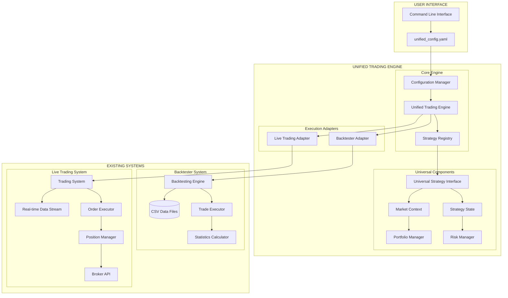
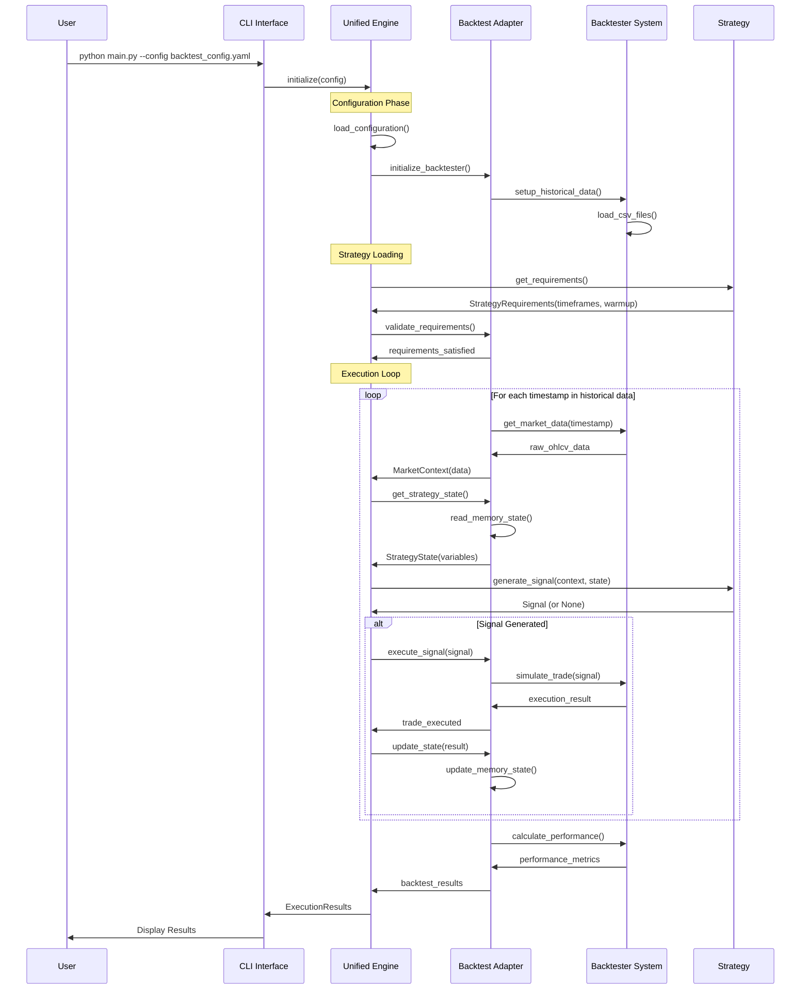
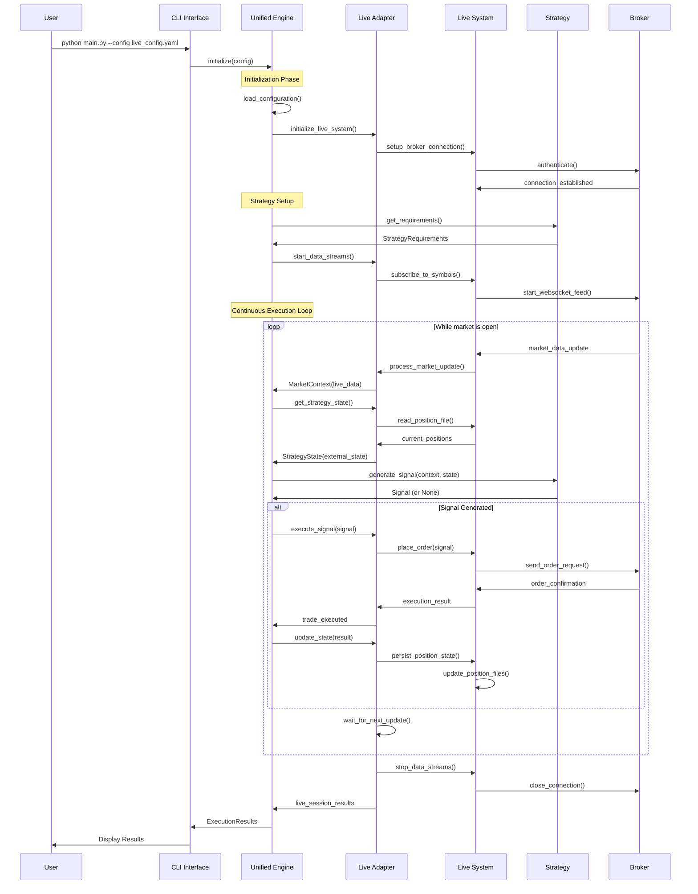
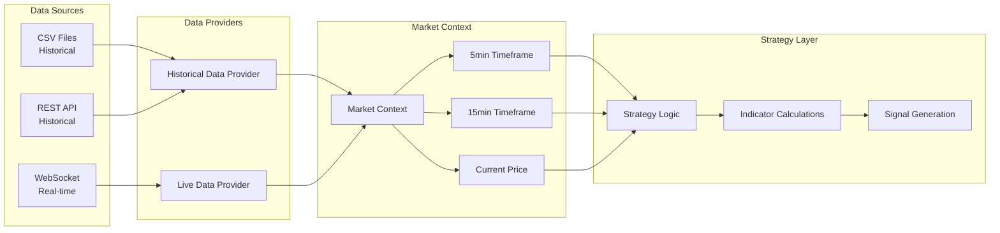
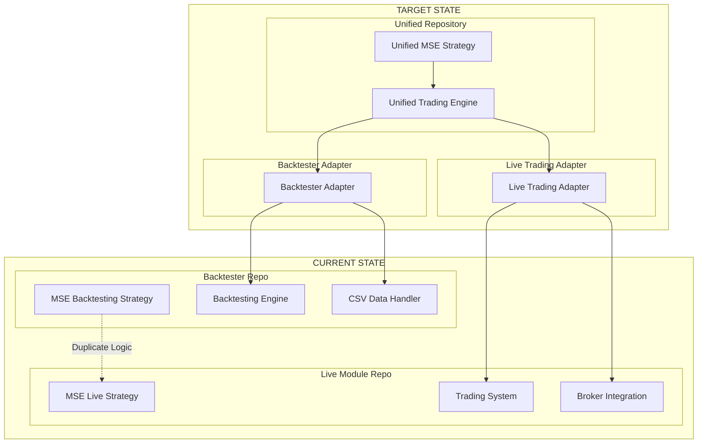
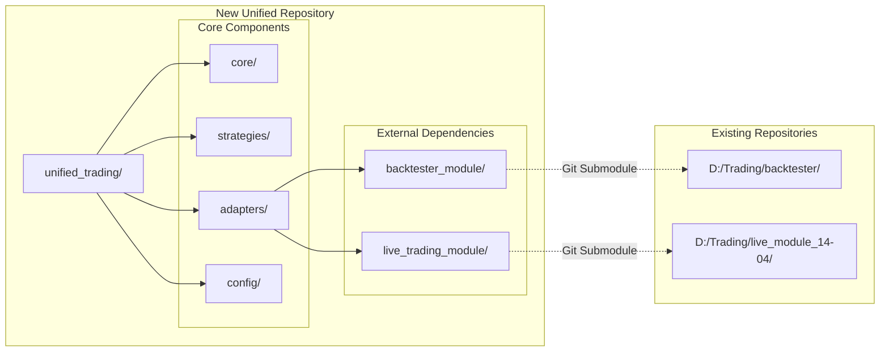
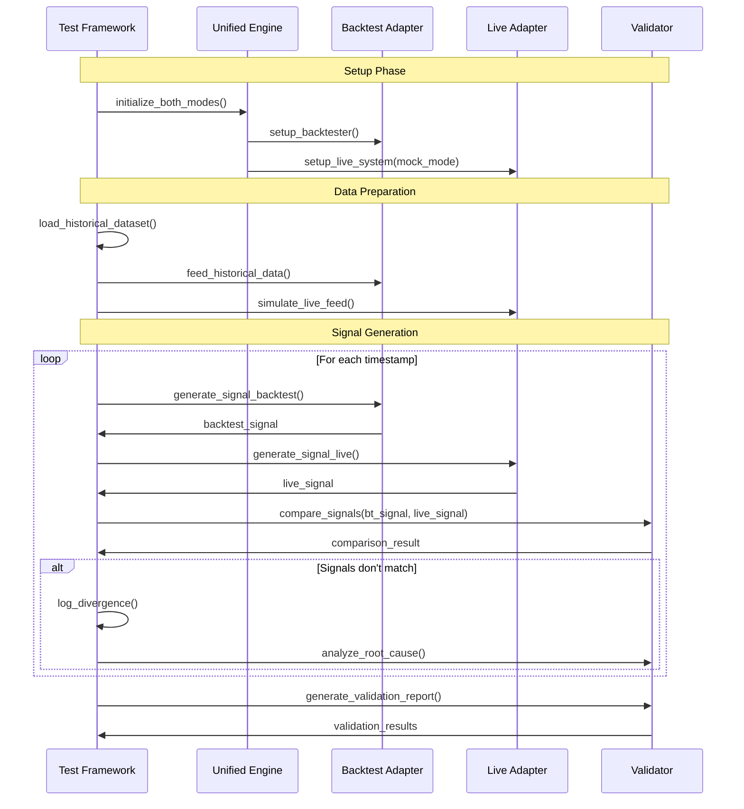
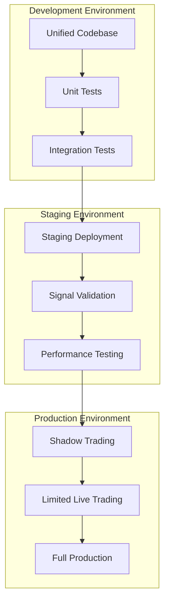
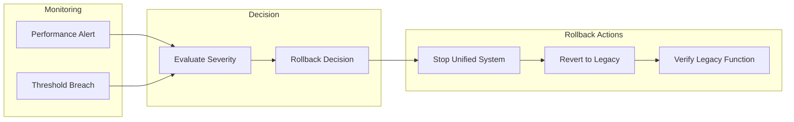

# 📊 System Flow Diagrams

## 🎯 Complete System Flow Overview

### **Unified Trading Engine - High Level Architecture**



## 🔄 Execution Flow Diagrams

### **1. Strategy Execution Flow - Backtesting Mode**



### **2. Strategy Execution Flow - Live Trading Mode**



## 📈 Data Flow Architecture

### **Market Data Flow - Unified Abstraction**



### **State Management Flow**

```mermaid
graph TB
    subgraph "Strategy Layer"
        ST[Strategy Logic]
        VARS[Strategy Variables]
    end

    subgraph "State Abstraction"
        SS[Strategy State Interface]
        GET[get(key)]
        SET[set(key, value)]
        POS[get_position_info()]
    end

    subgraph "Backtester State"
        MEM[In-Memory Storage]
        DICT[Python Dictionary]
        OBJ[Position Object]
    end

    subgraph "Live Trading State"
        EXT[External Storage]
        JSON[JSON Files]
        PM[Position Manager]
    end

    ST --> VARS
    VARS --> SS
    SS --> GET
    SS --> SET
    SS --> POS

    GET --> MEM
    SET --> MEM
    POS --> MEM

    GET --> EXT
    SET --> EXT
    POS --> EXT

    MEM --> DICT
    MEM --> OBJ

    EXT --> JSON
    EXT --> PM
```

## 🏗️ Repository Integration Flow

### **Current State vs Target State**



### **Repository Structure Flow**



## 🔧 MSE Strategy Migration Flow

### **Current MSE vs Unified MSE**

```mermaid
graph TB
    subgraph "CURRENT IMPLEMENTATIONS"
        subgraph "Backtester MSE"
            BT_MSE[MSEStrategyBacktesting]
            BT_EXEC[execute_strategy()]
            BT_POS[Internal position tracking]
            BT_EXIT[Exit logic in execution loop]
        end

        subgraph "Live MSE"
            LT_MSE[MSEStrategy]
            LT_SIG[generate_signal()]
            LT_EXT[External position management]
            LT_MODE[Entry/Exit mode architecture]
        end
    end

    subgraph "UNIFIED IMPLEMENTATION"
        subgraph "Unified MSE Strategy"
            UN_MSE[UnifiedMSEStrategy]
            UN_REQ[get_requirements()]
            UN_SIG[generate_signal()]
            UN_INIT[initialize_state()]
        end

        subgraph "Shared Logic"
            CALC[calculate_indicators()]
            ENTRY[check_entry_conditions()]
            EXIT[check_exit_conditions()]
            CONF[calculate_confidence()]
        end
    end

    BT_MSE -.->|Extract Logic| UN_MSE
    LT_MSE -.->|Extract Logic| UN_MSE

    UN_MSE --> UN_REQ
    UN_MSE --> UN_SIG
    UN_MSE --> UN_INIT

    UN_SIG --> CALC
    UN_SIG --> ENTRY
    UN_SIG --> EXIT
    UN_SIG --> CONF
```

## 🧪 Testing and Validation Flow

### **Signal Parity Validation Pipeline**



### **Performance Validation Flow**

```mermaid
graph LR
    subgraph "Input Data"
        HIST[Historical Data]
        CONFIG[Test Configuration]
    end

    subgraph "Execution Engines"
        BT_ENG[Backtest Engine]
        LIVE_ENG[Live Engine (Paper)]
    end

    subgraph "Signal Capture"
        BT_SIG[Backtest Signals]
        LIVE_SIG[Live Signals]
    end

    subgraph "Validation Layer"
        COMP[Signal Comparator]
        STATS[Statistical Analysis]
        REPORT[Validation Report]
    end

    HIST --> BT_ENG
    HIST --> LIVE_ENG
    CONFIG --> BT_ENG
    CONFIG --> LIVE_ENG

    BT_ENG --> BT_SIG
    LIVE_ENG --> LIVE_SIG

    BT_SIG --> COMP
    LIVE_SIG --> COMP

    COMP --> STATS
    STATS --> REPORT
```

## 🚀 Deployment Flow

### **Staged Deployment Pipeline**



### **Rollback Strategy Flow**



---

## 🎯 Flow Summary

These diagrams illustrate:

1. **System Integration**: How unified engine coordinates with existing systems
2. **Data Flow**: How market data flows through abstraction layers
3. **State Management**: How strategy state is handled differently across environments
4. **Repository Structure**: How to organize code for maximum reusability
5. **Migration Strategy**: How to move from current to unified implementation
6. **Validation Process**: How to ensure identical behavior across environments
7. **Deployment Pipeline**: How to safely roll out the unified system

Each flow diagram can be implemented incrementally, allowing for staged development and validation of the unified trading system.

**Next**: Review [Implementation Plan](../implementation/IMPLEMENTATION_PLAN.md) for detailed development steps.