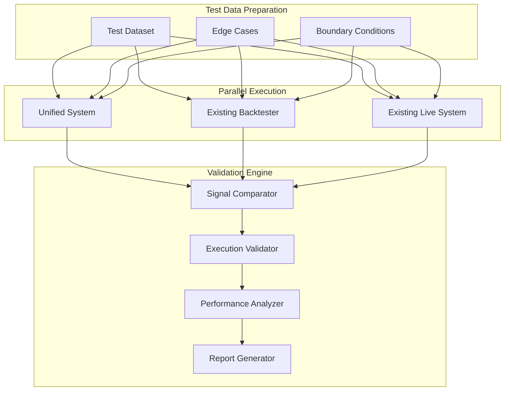

# 🧪 Unified Trading System Validation Framework

## 🎯 Validation Objectives

The validation framework ensures that the unified trading system produces **identical results** to existing backtesting and live trading systems. This is critical for maintaining confidence in strategy performance and avoiding "works in backtest but fails live" scenarios.

### **Core Validation Principles**

1. **Signal Parity**: Same inputs → Same signals across all environments
2. **Execution Consistency**: Same signals → Same execution outcomes (accounting for environment differences)
3. **State Synchronization**: Same strategy state evolution across environments
4. **Performance Preservation**: Unified system performance matches existing systems
5. **Behavioral Equivalence**: All edge cases and error conditions handled identically

## 🔬 Validation Architecture

### **Validation Pipeline Overview**



## 📊 Validation Components

### **1. Signal Parity Validation**

#### **Signal Comparator Framework**

```python
# tests/validation/signal_comparator.py
from typing import List, Dict, Any, Tuple
from dataclasses import dataclass
from datetime import datetime
import pandas as pd
import numpy as np

@dataclass
class SignalComparison:
    timestamp: datetime
    symbol: str
    unified_signal: Dict[str, Any]
    existing_signal: Dict[str, Any]
    is_identical: bool
    differences: List[str]
    tolerance_passed: bool

@dataclass
class ValidationResult:
    total_comparisons: int
    identical_signals: int
    tolerance_passed: int
    parity_percentage: float
    differences_summary: Dict[str, int]
    critical_differences: List[SignalComparison]

class SignalComparator:
    """Compares signals between unified and existing implementations"""

    def __init__(self, tolerance_config: Dict[str, float] = None):
        self.tolerance_config = tolerance_config or {
            'price_tolerance': 0.01,      # ₹0.01 price difference
            'confidence_tolerance': 0.02,  # 2% confidence difference
            'timing_tolerance': 1.0        # 1 second timing difference
        }

    def compare_signals(self,
                       unified_signals: List[Dict],
                       existing_signals: List[Dict]) -> ValidationResult:
        """Compare signals from both implementations"""

        comparisons = []
        identical_count = 0
        tolerance_passed_count = 0

        # Align signals by timestamp
        aligned_signals = self._align_signals_by_timestamp(unified_signals, existing_signals)

        for timestamp, (unified, existing) in aligned_signals.items():
            comparison = self._compare_single_signal(timestamp, unified, existing)
            comparisons.append(comparison)

            if comparison.is_identical:
                identical_count += 1
            if comparison.tolerance_passed:
                tolerance_passed_count += 1

        # Analyze differences
        differences_summary = self._analyze_differences(comparisons)
        critical_differences = [c for c in comparisons if not c.tolerance_passed]

        return ValidationResult(
            total_comparisons=len(comparisons),
            identical_signals=identical_count,
            tolerance_passed=tolerance_passed_count,
            parity_percentage=(identical_count / len(comparisons)) * 100 if comparisons else 0,
            differences_summary=differences_summary,
            critical_differences=critical_differences
        )

    def _compare_single_signal(self, timestamp: datetime, unified: Dict, existing: Dict) -> SignalComparison:
        """Compare individual signals with tolerance checking"""

        differences = []
        is_identical = True
        tolerance_passed = True

        # Compare action
        if unified.get('action') != existing.get('action'):
            differences.append(f"action: {unified.get('action')} vs {existing.get('action')}")
            is_identical = False
            tolerance_passed = False  # Action differences are critical

        # Compare price with tolerance
        unified_price = unified.get('price', 0)
        existing_price = existing.get('price', 0)
        price_diff = abs(unified_price - existing_price)

        if price_diff > 0:
            is_identical = False
            if price_diff > self.tolerance_config['price_tolerance']:
                differences.append(f"price: {unified_price} vs {existing_price} (diff: {price_diff})")
                tolerance_passed = False

        # Compare confidence with tolerance
        unified_conf = unified.get('confidence', 0)
        existing_conf = existing.get('confidence', 0)
        conf_diff = abs(unified_conf - existing_conf)

        if conf_diff > 0:
            is_identical = False
            if conf_diff > self.tolerance_config['confidence_tolerance']:
                differences.append(f"confidence: {unified_conf} vs {existing_conf} (diff: {conf_diff})")

        # Compare reasoning (informational only)
        if unified.get('reason') != existing.get('reason'):
            differences.append(f"reason: '{unified.get('reason')}' vs '{existing.get('reason')}'")
            is_identical = False

        return SignalComparison(
            timestamp=timestamp,
            symbol=unified.get('symbol', 'UNKNOWN'),
            unified_signal=unified,
            existing_signal=existing,
            is_identical=is_identical,
            differences=differences,
            tolerance_passed=tolerance_passed
        )

    def _align_signals_by_timestamp(self, unified_signals: List[Dict], existing_signals: List[Dict]) -> Dict:
        """Align signals by timestamp for comparison"""

        unified_by_time = {sig['timestamp']: sig for sig in unified_signals}
        existing_by_time = {sig['timestamp']: sig for sig in existing_signals}

        all_timestamps = set(unified_by_time.keys()) | set(existing_by_time.keys())

        aligned = {}
        for timestamp in sorted(all_timestamps):
            unified = unified_by_time.get(timestamp, {'timestamp': timestamp, 'action': None})
            existing = existing_by_time.get(timestamp, {'timestamp': timestamp, 'action': None})
            aligned[timestamp] = (unified, existing)

        return aligned
```

#### **Automated Signal Testing**

```python
# tests/validation/test_signal_parity.py
import pytest
from datetime import datetime, timedelta
import pandas as pd

from core.engine.unified_engine import UnifiedTradingEngine
from strategies.mse.unified_mse_strategy import UnifiedMSEStrategy
from tests.validation.signal_comparator import SignalComparator

class TestSignalParity:
    """Comprehensive signal parity testing"""

    @pytest.fixture
    def test_data(self):
        """Standard test dataset for signal comparison"""
        return self._load_standard_test_dataset()

    @pytest.fixture
    def edge_case_data(self):
        """Edge case test data"""
        return self._load_edge_case_dataset()

    def test_mse_signal_parity_standard_dataset(self, test_data):
        """Test MSE signal parity on standard dataset"""

        # Execute unified system
        unified_engine = UnifiedTradingEngine(self._get_test_config('backtest'))
        unified_signals = unified_engine.run_strategy_validation(UnifiedMSEStrategy(), test_data)

        # Execute existing backtester
        existing_signals = self._run_existing_backtester(test_data)

        # Compare signals
        comparator = SignalComparator()
        result = comparator.compare_signals(unified_signals, existing_signals)

        # Assertions
        assert result.parity_percentage >= 99.5, f"Signal parity {result.parity_percentage}% below threshold"
        assert len(result.critical_differences) == 0, f"Found {len(result.critical_differences)} critical differences"

        # Log results for analysis
        self._log_validation_results(result, "MSE_Standard_Dataset")

    def test_mse_signal_parity_edge_cases(self, edge_case_data):
        """Test MSE signal parity on edge cases"""

        for test_case in edge_case_data:
            unified_signals = self._run_unified_system(test_case)
            existing_signals = self._run_existing_system(test_case)

            comparator = SignalComparator()
            result = comparator.compare_signals(unified_signals, existing_signals)

            assert result.tolerance_passed >= result.total_comparisons * 0.95, \
                f"Edge case '{test_case['name']}' failed tolerance check"

    def test_mse_state_consistency(self, test_data):
        """Test strategy state consistency across environments"""

        # Run both systems and capture state evolution
        unified_states = self._capture_unified_state_evolution(test_data)
        existing_states = self._capture_existing_state_evolution(test_data)

        # Compare state evolution
        state_comparisons = self._compare_state_evolution(unified_states, existing_states)

        # Validate critical state variables
        critical_vars = ['macd_peak', 'position_side', 'entry_price']
        for var in critical_vars:
            var_comparison = state_comparisons.get(var, {})
            assert var_comparison.get('parity_percentage', 0) >= 99.0, \
                f"State variable '{var}' parity below threshold"

    @pytest.mark.performance
    def test_execution_performance_parity(self, test_data):
        """Test that unified system performance matches existing system"""

        # Run performance comparison
        unified_metrics = self._run_unified_performance_test(test_data)
        existing_metrics = self._run_existing_performance_test(test_data)

        # Compare key metrics
        metrics_to_compare = [
            'total_return', 'win_rate', 'max_drawdown',
            'sharpe_ratio', 'total_trades', 'average_trade_return'
        ]

        for metric in metrics_to_compare:
            unified_val = unified_metrics.get(metric, 0)
            existing_val = existing_metrics.get(metric, 0)

            if existing_val != 0:
                diff_percentage = abs((unified_val - existing_val) / existing_val) * 100
                assert diff_percentage <= 1.0, \
                    f"Performance metric '{metric}' differs by {diff_percentage}%"

    def _load_standard_test_dataset(self):
        """Load comprehensive test dataset"""
        return {
            'symbols': ['RELIANCE', 'TCS', 'INFY'],
            'date_range': {
                'start': '2024-01-01',
                'end': '2024-03-31'
            },
            'timeframes': ['5m', '15m'],
            'scenarios': [
                'trending_market',
                'sideways_market',
                'volatile_market',
                'gap_up_opening',
                'gap_down_opening'
            ]
        }

    def _load_edge_case_dataset(self):
        """Load edge case test scenarios"""
        return [
            {
                'name': 'missing_data_gaps',
                'description': 'Test behavior with missing data points',
                'data': self._generate_missing_data_scenario()
            },
            {
                'name': 'extreme_volatility',
                'description': 'Test behavior during extreme price movements',
                'data': self._generate_volatility_scenario()
            },
            {
                'name': 'market_open_close',
                'description': 'Test behavior at market open/close boundaries',
                'data': self._generate_boundary_scenario()
            },
            {
                'name': 'zero_volume_periods',
                'description': 'Test behavior during zero volume periods',
                'data': self._generate_zero_volume_scenario()
            }
        ]
```

### **2. Performance Validation Framework**

#### **Performance Metrics Comparator**

```python
# tests/validation/performance_validator.py
from typing import Dict, List, Any
from dataclasses import dataclass
import numpy as np
import pandas as pd

@dataclass
class PerformanceComparison:
    metric_name: str
    unified_value: float
    existing_value: float
    difference: float
    difference_percentage: float
    within_tolerance: bool
    tolerance_threshold: float

@dataclass
class PerformanceValidationResult:
    total_metrics: int
    metrics_within_tolerance: int
    validation_passed: bool
    critical_failures: List[PerformanceComparison]
    all_comparisons: List[PerformanceComparison]

class PerformanceValidator:
    """Validates performance metrics between implementations"""

    def __init__(self):
        # Define tolerance thresholds for different metrics
        self.tolerance_thresholds = {
            'total_return': 0.5,           # 0.5% difference allowed
            'total_return_percent': 0.5,
            'win_rate': 1.0,              # 1% difference allowed
            'total_trades': 0,            # Must be identical
            'winning_trades': 0,          # Must be identical
            'losing_trades': 0,           # Must be identical
            'max_profit': 1.0,            # 1% difference allowed
            'max_loss': 1.0,              # 1% difference allowed
            'average_trade_return': 2.0,   # 2% difference allowed
            'sharpe_ratio': 5.0,          # 5% difference allowed
            'max_drawdown': 1.0,          # 1% difference allowed
            'profit_factor': 2.0          # 2% difference allowed
        }

    def validate_performance(self,
                           unified_metrics: Dict[str, float],
                           existing_metrics: Dict[str, float]) -> PerformanceValidationResult:
        """Compare performance metrics between implementations"""

        comparisons = []
        metrics_within_tolerance = 0

        all_metrics = set(unified_metrics.keys()) | set(existing_metrics.keys())

        for metric_name in all_metrics:
            unified_val = unified_metrics.get(metric_name, 0)
            existing_val = existing_metrics.get(metric_name, 0)
            tolerance = self.tolerance_thresholds.get(metric_name, 1.0)

            comparison = self._compare_metric(
                metric_name, unified_val, existing_val, tolerance
            )
            comparisons.append(comparison)

            if comparison.within_tolerance:
                metrics_within_tolerance += 1

        # Identify critical failures
        critical_failures = [c for c in comparisons if not c.within_tolerance]

        # Overall validation passes if >95% of metrics within tolerance
        validation_passed = (metrics_within_tolerance / len(comparisons)) >= 0.95

        return PerformanceValidationResult(
            total_metrics=len(comparisons),
            metrics_within_tolerance=metrics_within_tolerance,
            validation_passed=validation_passed,
            critical_failures=critical_failures,
            all_comparisons=comparisons
        )

    def _compare_metric(self, name: str, unified: float, existing: float, tolerance: float) -> PerformanceComparison:
        """Compare individual performance metric"""

        difference = unified - existing

        if existing != 0:
            difference_percentage = abs(difference / existing) * 100
        else:
            difference_percentage = 0 if unified == 0 else 100

        within_tolerance = difference_percentage <= tolerance

        return PerformanceComparison(
            metric_name=name,
            unified_value=unified,
            existing_value=existing,
            difference=difference,
            difference_percentage=difference_percentage,
            within_tolerance=within_tolerance,
            tolerance_threshold=tolerance
        )
```

### **3. Execution Validation Framework**

#### **Trade Execution Comparator**

```python
# tests/validation/execution_validator.py
from typing import List, Dict, Any, Tuple
from dataclasses import dataclass
from datetime import datetime
import pandas as pd

@dataclass
class TradeComparison:
    trade_id: str
    entry_time_unified: datetime
    entry_time_existing: datetime
    entry_price_unified: float
    entry_price_existing: float
    exit_time_unified: datetime
    exit_time_existing: datetime
    exit_price_unified: float
    exit_price_existing: float
    pnl_unified: float
    pnl_existing: float
    execution_matched: bool
    timing_matched: bool
    price_matched: bool

class ExecutionValidator:
    """Validates trade execution between unified and existing systems"""

    def __init__(self, timing_tolerance_seconds: int = 300):  # 5 minutes tolerance
        self.timing_tolerance = timing_tolerance_seconds

    def validate_trades(self,
                       unified_trades: List[Dict],
                       existing_trades: List[Dict]) -> Dict[str, Any]:
        """Compare trade execution between systems"""

        # Align trades by entry time
        aligned_trades = self._align_trades(unified_trades, existing_trades)

        comparisons = []
        matched_executions = 0
        matched_timing = 0
        matched_prices = 0

        for unified_trade, existing_trade in aligned_trades:
            if unified_trade and existing_trade:
                comparison = self._compare_trade_execution(unified_trade, existing_trade)
                comparisons.append(comparison)

                if comparison.execution_matched:
                    matched_executions += 1
                if comparison.timing_matched:
                    matched_timing += 1
                if comparison.price_matched:
                    matched_prices += 1

        return {
            'total_trades_compared': len(comparisons),
            'execution_match_rate': (matched_executions / len(comparisons)) * 100 if comparisons else 0,
            'timing_match_rate': (matched_timing / len(comparisons)) * 100 if comparisons else 0,
            'price_match_rate': (matched_prices / len(comparisons)) * 100 if comparisons else 0,
            'trade_comparisons': comparisons,
            'validation_passed': matched_executions >= len(comparisons) * 0.95
        }

    def _compare_trade_execution(self, unified: Dict, existing: Dict) -> TradeComparison:
        """Compare individual trade execution"""

        # Extract trade data
        entry_time_u = unified.get('entry_timestamp')
        entry_time_e = existing.get('entry_timestamp')
        entry_price_u = unified.get('entry_price', 0)
        entry_price_e = existing.get('entry_price', 0)

        exit_time_u = unified.get('exit_timestamp')
        exit_time_e = existing.get('exit_timestamp')
        exit_price_u = unified.get('exit_price', 0)
        exit_price_e = existing.get('exit_price', 0)

        pnl_u = unified.get('pnl', 0)
        pnl_e = existing.get('pnl', 0)

        # Check timing match (within tolerance)
        timing_matched = self._times_within_tolerance(entry_time_u, entry_time_e)
        if exit_time_u and exit_time_e:
            timing_matched = timing_matched and self._times_within_tolerance(exit_time_u, exit_time_e)

        # Check price match (within 0.1% tolerance for execution differences)
        price_matched = self._prices_within_tolerance(entry_price_u, entry_price_e, 0.001)
        if exit_price_u and exit_price_e:
            price_matched = price_matched and self._prices_within_tolerance(exit_price_u, exit_price_e, 0.001)

        # Overall execution match
        execution_matched = timing_matched and price_matched

        return TradeComparison(
            trade_id=f"{unified.get('symbol', 'UNK')}_{entry_time_u}",
            entry_time_unified=entry_time_u,
            entry_time_existing=entry_time_e,
            entry_price_unified=entry_price_u,
            entry_price_existing=entry_price_e,
            exit_time_unified=exit_time_u,
            exit_time_existing=exit_time_e,
            exit_price_unified=exit_price_u,
            exit_price_existing=exit_price_e,
            pnl_unified=pnl_u,
            pnl_existing=pnl_e,
            execution_matched=execution_matched,
            timing_matched=timing_matched,
            price_matched=price_matched
        )

    def _align_trades(self, unified_trades: List[Dict], existing_trades: List[Dict]) -> List[Tuple]:
        """Align trades between systems by entry time"""

        # Sort trades by entry time
        unified_sorted = sorted(unified_trades, key=lambda x: x.get('entry_timestamp', datetime.min))
        existing_sorted = sorted(existing_trades, key=lambda x: x.get('entry_timestamp', datetime.min))

        aligned = []
        u_idx = 0
        e_idx = 0

        while u_idx < len(unified_sorted) and e_idx < len(existing_sorted):
            u_trade = unified_sorted[u_idx]
            e_trade = existing_sorted[e_idx]

            u_time = u_trade.get('entry_timestamp')
            e_time = e_trade.get('entry_timestamp')

            if self._times_within_tolerance(u_time, e_time):
                # Trades match within tolerance
                aligned.append((u_trade, e_trade))
                u_idx += 1
                e_idx += 1
            elif u_time < e_time:
                # Unified trade is earlier
                aligned.append((u_trade, None))
                u_idx += 1
            else:
                # Existing trade is earlier
                aligned.append((None, e_trade))
                e_idx += 1

        # Add remaining trades
        while u_idx < len(unified_sorted):
            aligned.append((unified_sorted[u_idx], None))
            u_idx += 1

        while e_idx < len(existing_sorted):
            aligned.append((None, existing_sorted[e_idx]))
            e_idx += 1

        return aligned

    def _times_within_tolerance(self, time1: datetime, time2: datetime) -> bool:
        """Check if times are within tolerance"""
        if not time1 or not time2:
            return False
        return abs((time1 - time2).total_seconds()) <= self.timing_tolerance

    def _prices_within_tolerance(self, price1: float, price2: float, tolerance: float) -> bool:
        """Check if prices are within tolerance percentage"""
        if price2 == 0:
            return price1 == 0
        return abs((price1 - price2) / price2) <= tolerance
```

## 🚀 Continuous Validation Pipeline

### **Automated Testing Pipeline**

```python
# tests/validation/continuous_validation.py
import schedule
import time
from datetime import datetime, timedelta
from typing import Dict, Any
import logging

class ContinuousValidationPipeline:
    """Continuous validation of unified system against existing implementations"""

    def __init__(self, config: Dict[str, Any]):
        self.config = config
        self.logger = logging.getLogger(__name__)

        # Initialize validators
        self.signal_comparator = SignalComparator()
        self.performance_validator = PerformanceValidator()
        self.execution_validator = ExecutionValidator()

        # Set up validation schedule
        self._setup_validation_schedule()

    def _setup_validation_schedule(self):
        """Set up automated validation schedule"""

        # Daily signal parity validation
        schedule.every().day.at("06:00").do(self._run_daily_signal_validation)

        # Weekly performance validation
        schedule.every().sunday.at("06:00").do(self._run_weekly_performance_validation)

        # Monthly comprehensive validation
        schedule.every().month.do(self._run_monthly_comprehensive_validation)

    def run_validation_pipeline(self):
        """Main validation pipeline entry point"""

        self.logger.info("Starting continuous validation pipeline")

        while True:
            schedule.run_pending()
            time.sleep(3600)  # Check every hour

    def _run_daily_signal_validation(self):
        """Daily signal parity validation"""

        try:
            # Get yesterday's market data
            test_date = datetime.now() - timedelta(days=1)
            test_data = self._get_market_data_for_date(test_date)

            if not test_data:
                self.logger.info(f"No market data available for {test_date.date()}")
                return

            # Run signal comparison
            unified_signals = self._run_unified_system(test_data)
            existing_signals = self._run_existing_system(test_data)

            result = self.signal_comparator.compare_signals(unified_signals, existing_signals)

            # Log results
            self.logger.info(f"Daily validation - Signal parity: {result.parity_percentage:.2f}%")

            # Alert if parity drops below threshold
            if result.parity_percentage < 99.0:
                self._send_alert(f"Signal parity dropped to {result.parity_percentage:.2f}%", result)

            # Store results for trending
            self._store_validation_results("daily_signal_parity", result)

        except Exception as e:
            self.logger.error(f"Daily signal validation failed: {e}")
            self._send_alert(f"Daily validation pipeline failed: {e}")

    def _run_weekly_performance_validation(self):
        """Weekly performance comparison validation"""

        try:
            # Get last week's data
            end_date = datetime.now()
            start_date = end_date - timedelta(weeks=1)

            test_data = self._get_market_data_for_range(start_date, end_date)

            # Run performance comparison
            unified_metrics = self._run_unified_performance_test(test_data)
            existing_metrics = self._run_existing_performance_test(test_data)

            result = self.performance_validator.validate_performance(
                unified_metrics, existing_metrics
            )

            self.logger.info(f"Weekly validation - Performance match: {result.validation_passed}")

            if not result.validation_passed:
                self._send_alert("Weekly performance validation failed", result)

            self._store_validation_results("weekly_performance", result)

        except Exception as e:
            self.logger.error(f"Weekly performance validation failed: {e}")

    def _send_alert(self, message: str, details: Any = None):
        """Send validation alert to monitoring system"""
        # Implementation depends on your alerting system
        # Could be email, Slack, webhook, etc.
        self.logger.warning(f"VALIDATION ALERT: {message}")
        if details:
            self.logger.warning(f"Alert details: {details}")
```

### **Validation Dashboard**

```python
# tests/validation/validation_dashboard.py
import streamlit as st
import plotly.graph_objects as go
import plotly.express as px
from datetime import datetime, timedelta
import pandas as pd

class ValidationDashboard:
    """Real-time validation monitoring dashboard"""

    def __init__(self):
        st.set_page_config(page_title="Unified Trading System Validation", layout="wide")

    def run_dashboard(self):
        """Main dashboard interface"""

        st.title("🧪 Unified Trading System Validation Dashboard")

        # Sidebar controls
        st.sidebar.title("Validation Controls")
        validation_type = st.sidebar.selectbox(
            "Validation Type",
            ["Signal Parity", "Performance Comparison", "Execution Validation", "All Validations"]
        )

        date_range = st.sidebar.date_input(
            "Date Range",
            value=[datetime.now() - timedelta(days=30), datetime.now()],
            max_value=datetime.now()
        )

        # Main content
        if validation_type == "Signal Parity":
            self._show_signal_parity_dashboard(date_range)
        elif validation_type == "Performance Comparison":
            self._show_performance_comparison_dashboard(date_range)
        elif validation_type == "Execution Validation":
            self._show_execution_validation_dashboard(date_range)
        else:
            self._show_comprehensive_dashboard(date_range)

    def _show_signal_parity_dashboard(self, date_range):
        """Signal parity validation dashboard"""

        st.header("📊 Signal Parity Validation")

        # Load validation data
        validation_data = self._load_validation_data("signal_parity", date_range)

        if validation_data.empty:
            st.warning("No validation data available for selected date range")
            return

        # Key metrics
        col1, col2, col3, col4 = st.columns(4)

        with col1:
            avg_parity = validation_data['parity_percentage'].mean()
            st.metric("Average Parity", f"{avg_parity:.2f}%")

        with col2:
            min_parity = validation_data['parity_percentage'].min()
            st.metric("Minimum Parity", f"{min_parity:.2f}%")

        with col3:
            total_comparisons = validation_data['total_comparisons'].sum()
            st.metric("Total Comparisons", f"{total_comparisons:,}")

        with col4:
            days_above_threshold = (validation_data['parity_percentage'] >= 99.0).sum()
            st.metric("Days Above 99%", f"{days_above_threshold}")

        # Parity trend chart
        fig = go.Figure()
        fig.add_trace(go.Scatter(
            x=validation_data['date'],
            y=validation_data['parity_percentage'],
            mode='lines+markers',
            name='Signal Parity %'
        ))
        fig.add_hline(y=99.0, line_dash="dash", line_color="red", annotation_text="99% Threshold")
        fig.update_layout(title="Signal Parity Trend", yaxis_title="Parity Percentage")
        st.plotly_chart(fig, use_container_width=True)

        # Differences analysis
        if 'differences_summary' in validation_data.columns:
            st.subheader("Common Differences Analysis")
            differences_df = self._analyze_differences_trends(validation_data)
            st.dataframe(differences_df)

    def _show_performance_comparison_dashboard(self, date_range):
        """Performance comparison dashboard"""

        st.header("📈 Performance Comparison")

        # Load performance data
        performance_data = self._load_validation_data("performance_comparison", date_range)

        # Performance metrics comparison
        metrics_to_display = [
            'total_return', 'win_rate', 'total_trades', 'max_drawdown', 'sharpe_ratio'
        ]

        for metric in metrics_to_display:
            if f'{metric}_unified' in performance_data.columns and f'{metric}_existing' in performance_data.columns:

                col1, col2 = st.columns(2)

                with col1:
                    fig = go.Figure()
                    fig.add_trace(go.Scatter(
                        x=performance_data['date'],
                        y=performance_data[f'{metric}_unified'],
                        mode='lines',
                        name='Unified System'
                    ))
                    fig.add_trace(go.Scatter(
                        x=performance_data['date'],
                        y=performance_data[f'{metric}_existing'],
                        mode='lines',
                        name='Existing System'
                    ))
                    fig.update_layout(title=f"{metric.title()} Comparison")
                    st.plotly_chart(fig, use_container_width=True)

                with col2:
                    # Difference analysis
                    differences = performance_data[f'{metric}_unified'] - performance_data[f'{metric}_existing']
                    avg_diff = differences.mean()
                    max_diff = differences.abs().max()

                    st.metric(f"Avg Difference ({metric})", f"{avg_diff:.4f}")
                    st.metric(f"Max Difference ({metric})", f"{max_diff:.4f}")
```

## 📋 Validation Checklist

### **Pre-Deployment Validation**

#### **Signal Parity Validation**
- [ ] >99.5% signal parity on comprehensive test dataset
- [ ] >99% signal parity on edge case scenarios
- [ ] All critical differences investigated and resolved
- [ ] Statistical significance of differences analyzed
- [ ] Timing alignment verified across all test scenarios

#### **Performance Validation**
- [ ] All key performance metrics within tolerance thresholds
- [ ] Trade count and sequence identical
- [ ] P&L calculations consistent (accounting for execution differences)
- [ ] Risk metrics (drawdown, Sharpe ratio) comparable
- [ ] Edge case performance validated

#### **State Management Validation**
- [ ] Strategy state evolution identical across environments
- [ ] Position tracking consistent
- [ ] Peak/valley tracking identical
- [ ] State persistence and recovery tested
- [ ] State synchronization across system restarts

#### **System Integration Validation**
- [ ] End-to-end execution flows tested
- [ ] Configuration management validated
- [ ] Error handling and recovery tested
- [ ] Performance benchmarks within acceptable ranges
- [ ] Monitoring and alerting operational

### **Production Validation (Ongoing)**

#### **Daily Validation**
- [ ] Signal parity check on previous day's data
- [ ] Performance metrics comparison
- [ ] Error rate monitoring
- [ ] System health checks

#### **Weekly Validation**
- [ ] Comprehensive performance analysis
- [ ] Trade execution validation
- [ ] System stability assessment
- [ ] User feedback collection

#### **Monthly Validation**
- [ ] Long-term performance trend analysis
- [ ] Strategy behavior evolution tracking
- [ ] System optimization opportunities
- [ ] Comprehensive validation report generation

---

## 🎯 Success Criteria

### **Validation Thresholds**

| Validation Type | Threshold | Critical | Description |
|---|---|---|---|
| Signal Parity | >99.5% | Yes | Identical signals between implementations |
| Performance Metrics | >95% within tolerance | Yes | Key metrics match within defined tolerances |
| Trade Execution | >95% timing match | Yes | Trade timing within acceptable ranges |
| State Consistency | >99% state parity | Yes | Strategy state evolution identical |
| System Performance | <50ms overhead | No | Latency overhead for live trading |

### **Continuous Monitoring**

- **Real-time Alerts**: Immediate notification of validation failures
- **Trend Analysis**: Long-term validation performance tracking
- **Automated Recovery**: Automatic fallback to existing systems if needed
- **Regular Reporting**: Weekly and monthly validation summary reports

This validation framework ensures that the unified trading system maintains perfect fidelity with existing implementations while providing comprehensive monitoring and alerting for ongoing operation.